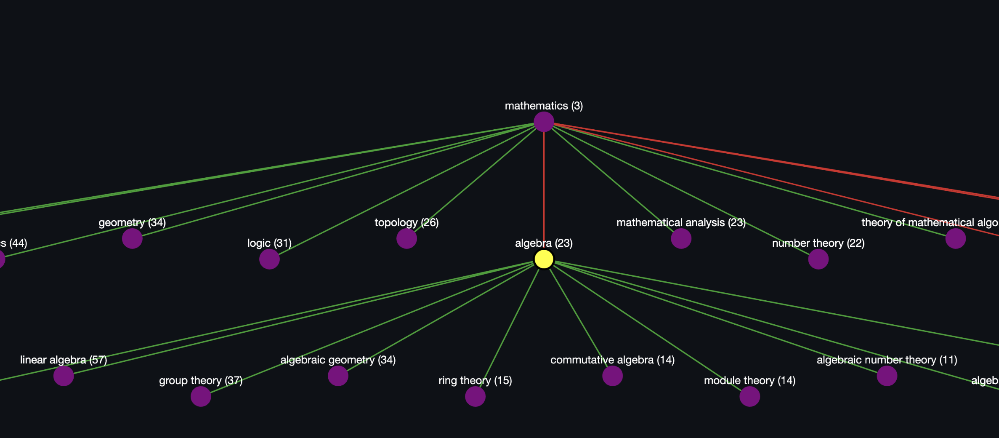

# 📚 Ontology Graph Explorer (Wikidata)

This demo project is an **interactive Streamlit web application** for exploring **Wikidata ontologies** as graphs.  
You can choose a scientific topic (e.g., Mathematics, Physics, Biology), and the app will query its subclass hierarchy using the **Wikidata SPARQL endpoint**.  
The result is an interactive graph where you can expand nodes by clicking on them.

---

## ✨ Features

- Query **Wikidata SPARQL** endpoint
- Visualize ontology hierarchies as graphs
- Relation-specific edge colors:
  - 🔵 P279 – Subclass of
  - 🟠 P31 – Instance of
  - 🟢 P361 – Part of
  - 🔴 P527 – Has part
- Node coloring by status:
  - 🟩 **expanded** – already expanded node
  - 🟪 **new** – newly loaded node
  - 🟥 **empty** – no subclasses available
- Interactive clickable graph powered by `cytoscape.js`
- Dynamic **tree layout** positioning
- Clean, simple **Streamlit UI**

### Main screen with topic selection


### Expanded ontology graph



---

## 🖼 Example usage

Select a topic from the dropdown (e.g., _Mathematics_).

Select which relations you want to query by ticking the checkboxes (colored dots indicate edge colors).

Press **Start with root** → the root node is created.

Click on a node in the graph to **select it**. The currently selected node is highlighted.

Press **Run query** to expand the selected node with the chosen relations.

The **log panel** above the graph will display:

the executed relations

number of children found

their labels and counts

## 📦 Installation

1. **Create a virtual environment**

   ```bash
   python3 -m venv .venv
   ```

2. **Activate it**

   ```bash
   source .venv/bin/activate
   ```

   _(On Windows: `.\.venv\Scripts\activate`)_

3. **Install dependencies**

   ```bash
   pip install -r requirements.txt
   ```

---

## 🚀 Run the app

```bash
streamlit run app.py
```

Then open your browser at:
👉 [http://localhost:8501](http://localhost:8501)

---

## ⚙️ Requirements

- **Python 3.8+**
- [Streamlit](https://streamlit.io/)
- [streamlit-cytoscapejs](https://github.com/streamlit/streamlit-cytoscapejs)
- [Requests](https://docs.python-requests.org/)

---

## 🖼 Example usage

1. Select a topic from the dropdown (e.g., _Mathematics_).
2. Click **Start generating ontology**.
3. The initial graph appears.
4. Click on nodes to expand them further.

---

## 🛠 Development tips

- To add more topics, extend the `TOPICS` dictionary in `wikipedia-sparql.py`.
- To experiment with different layouts, modify the `apply_tree_layout` function in `layout.py`.
- For larger graphs, increase the `limit` parameter in `get_children` (`query.py`).

---

## 📜 License

MIT License – free to use, modify, and distribute.

---
